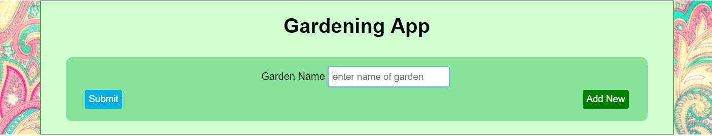
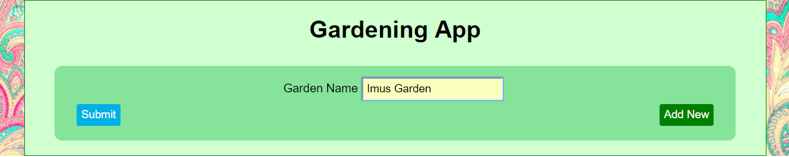
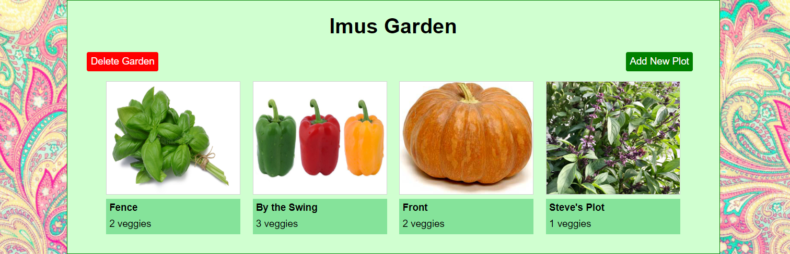

## __Live Site:__ [Gardening App](https://gardening-client.herokuapp.com/)

### Tech Stack:
<dl>
  <dt>Node</dt>
  <dd>Backend core for the code</dd>
  <dt>Mongo/Mongoose/Express</dt>
  <dd>Backend database link. Mongo structured the database, mongoose allowed it to interact with node, and express helped to simplify the code</dd>
  <dt>React/Redux</dt>
  <dd>React and redux allowed for a dynamic web page that doesn't have to reload and that integrates with the backend</dd>
</dl>
 
---

_The screen when you arrive_

_Either create a new garden, or use "Imus Garden" to see a filled out garden_

_When you click on a plot widget you will see an expanded view_

